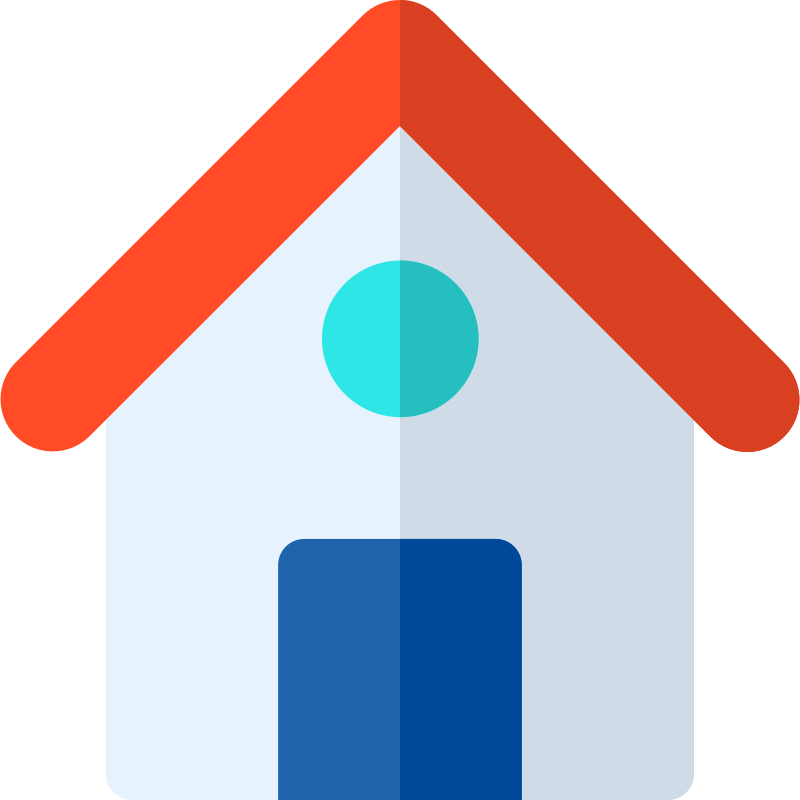

<h2 style="text-align: center;">Hey 👋, Good to See You!</h2>

    

        <!-- Content related to research -->
        
Currently based in Luxembourg, conducting research in <b>Computer Vision</b>, <b>Robot Perception</b>, and <b>Generative AI</b> at the Automation & Robotics Research Group (ARG) of the <a href="https://www.uni.lu/snt-en/" target="_blank">Interdisciplinary Center for Security Reliability, and Trust (SnT)</a>, University of Luxembourg.

    

  
  

### 📌 Where to Find Me

    
    
    
    
    
    
    
    
    
    
    
    
    
    
    
    
    
    

