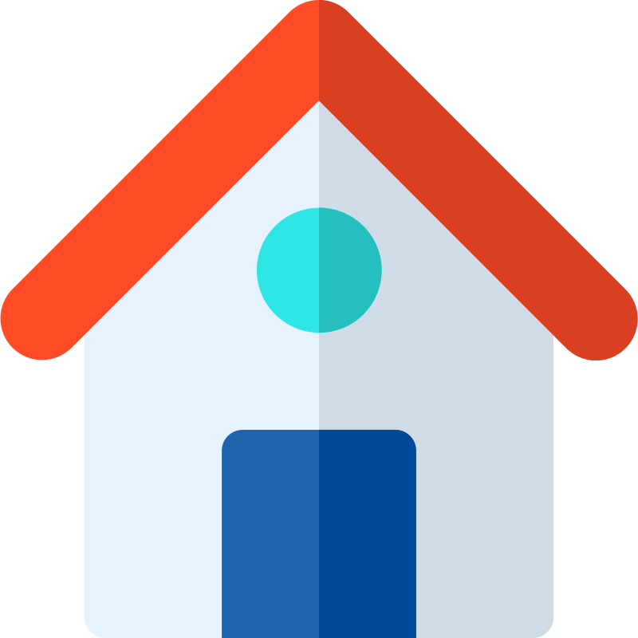

<h2 style="text-align: center;">Hey there, I'm Ali 👋</h2>

    

        

        <b>R&D Specialist</b> & <b>Senior Software Developer</b> 🔸 Computer Vision, Generative AI & Robotics Researcher at <a href="https://www.uni.lu/snt-en/" target="_blank">SnT</a>, UniLu 🔸 Based in Luxembourg 🔸 Open-source enthusiast building research-grade systems.
        

    

<!-- 

  

 -->

### ⭐ Featured Projects

- **🤖 Robotics & Perception:** [vS-Graphs](https://github.com/snt-arg/visual_sgraphs) |  [iMarker Detection](https://github.com/snt-arg/iMarker_detector_standalone) | [Robot-Suite](https://github.com/snt-arg/robot_suite) | [Scene Segment ROS](https://github.com/snt-arg/scene_segment_ros)
- **🧠 Generative AI & LLMs:** [Sentra](https://github.com/snt-arg/sentra) | [RAG-VisualRec](https://github.com/RecSys-lab/RAG-VisualRec)
- **👁️ Computer Vision:** [License Plate Detection](https://github.com/alitourani/yolo-license-plate-detection) | [Vehicle Detection](https://github.com/alitourani/deep-learning-vehicle-detection) | [Vehicle Speed Measurement](https://github.com/alitourani/vehicle-speed-measurement)
- **🗂️ Datasets:** [VLM-Thumbnails](https://huggingface.co/datasets/alitourani/movielens-25m-thumb) | [Popcorn](https://recsys-lab.github.io/popcorn_dataset/) | [Iranis](https://github.com/alitourani/Iranis-dataset) | [SMapper-Light](https://huggingface.co/datasets/snt-arg/smapper-light)
- **🔍 Information Retrieval & RecSys** [Popcorn Framework](https://github.com/RecSys-lab/Popcorn) | [CAPRI](https://github.com/CapriRecSys/CAPRI)

### 📌 Where to Find Me

<!-- 

    
    
    
    
    
    
    
    
    
    
    
    
    
    
    
    
    
    

 -->

